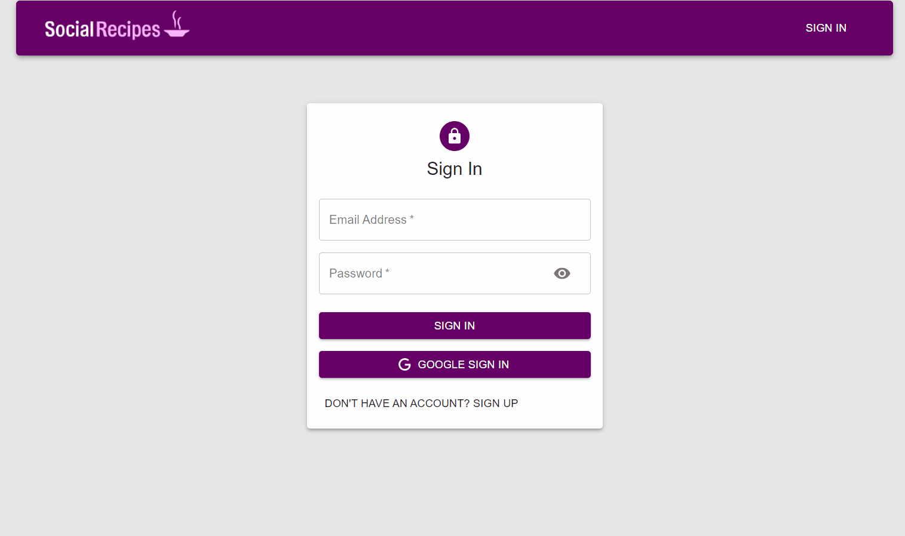

# Social-Recipes
A Full Stack Project ( MERN )  
try it with demo account:
Email: user@demo.com
Password: demouser

## Live Demo
Try the website live at: [https://social-recipes.herokuapp.com/](https://social-recipes.herokuapp.com/)

## Technologies Used
* HTML5
* CSS3
* Materia-UI
* React.js
* Node.js
* Express
* MongoDB

## Features
* Log in with emil (JWT).
* Log in with Googlr account (OAuth Authentication).
* User can add recipe.
* User can delete or edit recipe if loged in.
* User can like others post.

## Preview


### System Requirements
* Node.js 10 or higher
* Npm 6 or higher

### Getting Started
1. Clone the repository : 
      ``` 
      https://github.com/malmossa/Social-Recipes.git
      ```     
2. Install npm dependencies : 
      ``` 
      npm install 
      ```
5. Start the server : 
      ``` 
      npm run start
      ``` 
6. Visit http://localhost:3000 in your browser to view the application 
